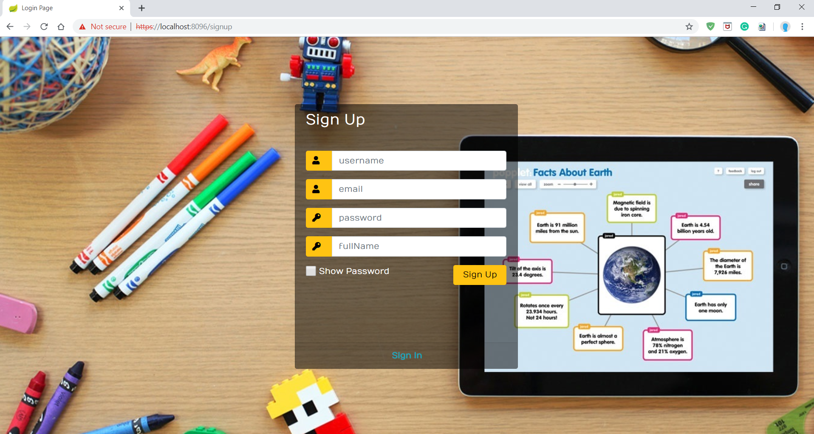

# Share Notes App

Main Technologies:
Spring + Kafka + MongoDB

1.  Run Kafka:
    Download and run the confluent services -
    follow this quick guide: https://docs.confluent.io/current/quickstart/index.html
    
2.  Install and run MongoDB - https://docs.mongodb.com/manual/installation/  

3.  Install Gradle:
    follow this installation guide - https://gradle.org/install/

4.  Clone or download and unzip this repository.

5.  In the command line run -  
    $ ./gradlew bootRun  
    OR  
    $ gradle bootRun  
    
    

 

 

 

 

 

   
 
